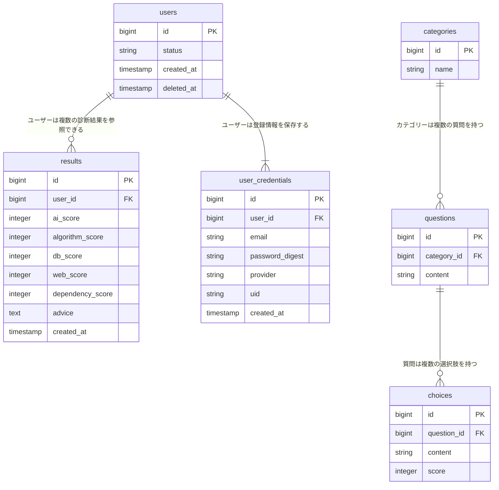

# 理解負債チェッカー

## サービスURL

https://debt-lens.org/

## サービス概要
理解負債チェッカーとは、AI時代のプログラミング学習診断・改善アプリです。
AIに頼りすぎて、「理解したつもり」になっていないかを診断します。

## 開発背景
過去にAIに頼ってエンジニアになったが、現場に入ってからプログラムがなぜ動くのかわからない状態に苦しみ、先輩に教えてもらっても理解できず強い焦りを感じた経験があります。

- エラーが出たらAIにそのまま貼り付けて解決している
- 仮に動いたとしても「なぜ動いたか」説明できない
- チュートリアルが終わっても、自力で1からコードを書いて作ることができない

AIに依存したまま学習を進めると、自力で問題を解決する力が身につかず、AIでも解決できない問題に直面したときに行き詰まってしまいます。

また、理解できていない状態で先に進んでも基礎が抜けているため、 応用が効かず、学習内容が定着しなくなります。

決して、AIを使うことを否定したいわけではありません。

ましてやこれからの時代、AIを使うことが必須の時代になると考えています。
しかし、AIを使いこなすにも基礎知識が必要です。

「なぜこうやってコードを書くとシステムが動くのか」理解せず深掘りしないで進めると、応用や問題解決が難しくなり、どんどん苦しくなることが予想されます。

このサービスでは、AIを活用しながらも、自分の理解度やAIとの向き合い方を見直すきっかけを提供したいと考えています。

## 機能一覧
- 認証
  - ゲストログイン
  - 通常ログイン( email / password )
  - Google ログイン
- 診断機能
- 結果・アドバイス表示
- 診断履歴確認

診断では、

- AI活用習慣
- アルゴリズム基礎
- データベース理解
- Web技術理解

などを複数の質問からスコア化し、ユーザーの理解傾向を分析できるようにしています。
また、診断結果をもとにAI依存度を算出し、学習改善のためのアドバイスを表示します。

## 使用技術
| カテゴリ | 使用技術 |
|:-------|:-------|
|バックエンド|Ruby 4.0 / Ruby on Rails 8.1 (APIモード)|
|フロントエンド|Next.js ・ React ・ TypeScript|
|CSSフレームワーク|TailwindCSS|
|データベース|PostgreSQL 14.13|
|認証|JWT ・ Auth.js|
|その他|RuboCop / Biome / RSpec|

## ER図

## インフラ構成図

## 開発状況

現在は MVP 段階として、認証機能・診断機能・診断履歴機能を中心に開発しています。

### 実装済み
- JWT認証
- Googleログイン
- ゲストログイン
- 簡易診断ロジック
- 診断履歴保存
- Rails API + Next.js 構成
- Docker環境整備
- RailsをAWS EC2へデプロイ
- Next.jsをAmplifyへデプロイ
- GitHub Actions による CIで、Rubocop / RSpec / Biome 実行

### 今後実装予定
- UI / UX 改善
- 診断結果一覧改善
- マイページ改善
- LPの充実
- テスト強化

## 技術的な工夫

### フロント・バックの分離
フロントとバックを分けて開発することによって、責務の分離を行いました。
これにより、バックではどのようなデータが必要になって配信すべきなのか明確になりました。

フロントエンドでは Next.js を採用し、APIから取得したデータを動的に表示することで、ユーザー体験を向上させるSPA構成を意識しています。

### 認証設計

Rails API と Next.js を分離した構成を採用し、JWT を用いた認証を実装しています。

また、

- 通常ログイン
- Googleログイン
- ゲストログイン

を共通の認証フローで扱えるよう設計しています。

### 保守性を意識した設計

- 診断ロジックは責務分離を意識し、スコア計算処理をサービスクラスへ切り出しています。
- usersテーブルにユーザー情報を集約するのではなく、認証情報をuser_credentialsテーブルへ分離することで、今後プロフィール情報などの追加要件が発生しても保守しやすい設計を意識しました。

### テスト

RSpec を用いて ModelSpec / RequestSpec を中心にテストを追加しています。
これにより期待した結果が返ってくるかどうか手動でなくシステムによって検証しています。

### ESLintよりもBiome

コード品質を保つためにBiomeを採用しています。

Lint・Formatter をBiomeへ統一することで、
ESLint + Prettier 構成よりも高速なコード整形・静的解析を実現しています。
